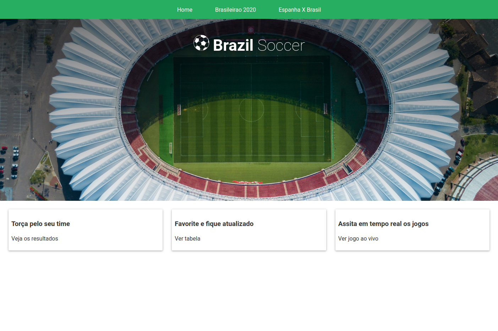
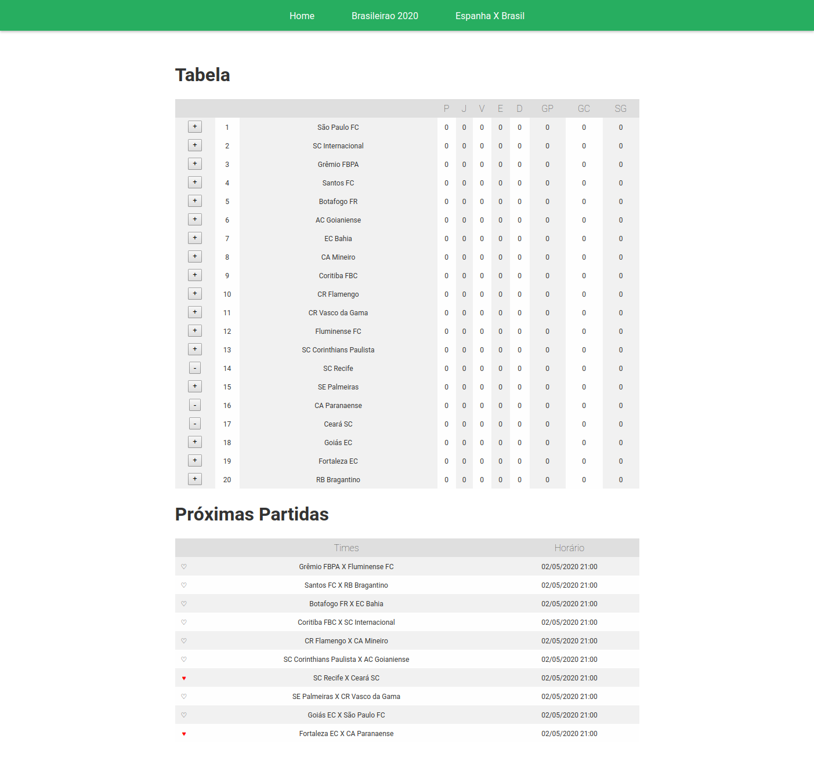
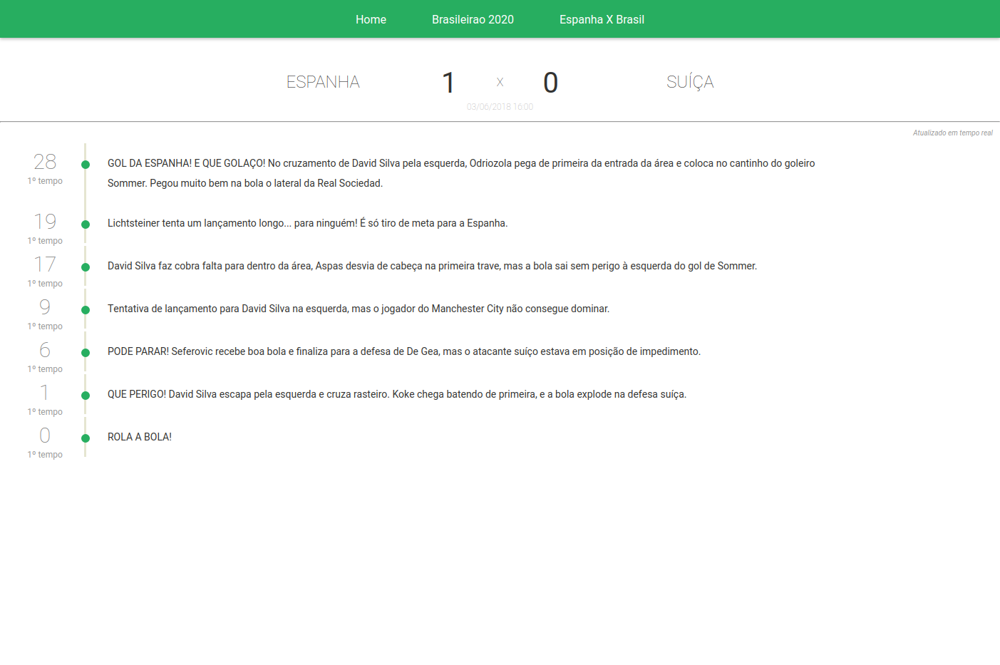

## Instalação

1 - Clone este repositório, logo após entre na pasta do projeto e rode:

```sh
npm install
```

2 - Crie uma conta no site [Football data](https://www.football-data.org/), e você receberá no seu email uma key:

3 - Copie o arquivo .env-example para .env e substitua o valor da chave REACT_APP_API_KEY pela key que você recebeu no email:

Para rodar:

```sh
npm start
```

## Telas do Projeto

<p align="center">
    
</p>

<p align="center">
    
</p>

<p align="center">
    
</p>
